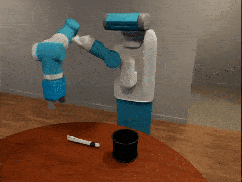

## ReKep: Spatio-Temporal Reasoning of Relational Keypoint Constraints for Robotic Manipulation

#### [[Project Page]](https://rekep-robot.github.io/) [[Paper]](https://rekep-robot.github.io/rekep.pdf) [[Video]](https://youtu.be/2S8YhBdLdww)

[Wenlong Huang](https://wenlong.page)<sup>1</sup>, [Chen Wang](https://www.chenwangjeremy.net/)<sup>1*</sup>, [Yunzhu Li](https://yunzhuli.github.io/)<sup>2*</sup>, [Ruohan Zhang](https://ai.stanford.edu/~zharu/)<sup>1</sup>, [Li Fei-Fei](https://profiles.stanford.edu/fei-fei-li)<sup>1</sup> (\* indicates equal contributions)

<sup>1</sup>Stanford University, <sup>3</sup>Columbia University


This is the official demo code for [ReKep](https://rekep-robot.github.io/) implemented in [OmniGibson](https://behavior.stanford.edu/omnigibson/index.html). ReKep is a method that uses large vision models and vision-language models in a hierarchical optimization framework to generate closed-loop trajectories for manipulation tasks.


## Setup Instructions

Note that this codebase is best run with a display. For running in headless mode, refer to the [instructions in OmniGibson](https://behavior.stanford.edu/omnigibson/getting_started/installation.html).

- Install [OmniGibson](https://behavior.stanford.edu/omnigibson/getting_started/installation.html). This code is tested on [this commit](https://github.com/StanfordVL/OmniGibson/tree/cc0316a0574018a3cb2956fcbff3be75c07cdf0f).

NOTE: If you encounter the warning `We did not find Isaac Sim under ~/.local/share/ov/pkg.` when running `./scripts/setup.sh` for OmniGibson, first ensure that you have installed Isaac Sim. Assuming Isaac Sim is installed in the default directory, then provide the following path `/home/[USERNAME]/.local/share/ov/pkg/isaac-sim-2023.1.1` (replace `[USERNAME]` with your username).

- Install ReKep in the same conda environment:
```Shell
conda activate omnigibson
cd ..
git clone https://github.com/huangwl18/ReKep.git
cd ReKep
pip install -r requirements.txt
```

- Obtain an [OpenAI API](https://openai.com/blog/openai-api) key and set it up as an environment variable:
```Shell
export OPENAI_API_KEY="YOUR_OPENAI_API_KEY"
```

## Running Demo

We provide a demo "pen-in-holder" task that illustrates the core idea in ReKep. Below we provide several options to run the demo.

Notes:
- An additional `--visualize` flag may be added to visualize every solution from optimization, but since the pipeline needs to repeatedly solves optimization problems, the visualization is blocking and needs to be closed every time in order to continue (by pressing "ESC").
- Due to challenges of determinism of the physics simulator, different runs with the same random seed may produce different results. It is possible that the robot may fail at the provided task, especially when external disturbances are applied. In this case, we recommend running the demo again.

### Demo with Cached Query

We recommend starting with the cached VLM query.

```Shell
python main.py --use_cached_query [--visualize]
```

A video will be saved to `./videos` by default.



### Demo with External Disturbances

Since ReKep acts as a closed-loop policy, it is robust to disturbances with automatic failure recovery both within stages and across stages. To demonstrate this in simulation, we apply the following disturbances for the "pen-in-holder" task:

- Move the pen when robot is trying to grasp the pen

- Take the pen out of the gripper when robot is trying to reorient the pen

- Move the holder when robot is trying to drop the pen into the holder


Note that since the disturbances are pre-defined, we recommend running with the cached query.

```Shell
python main.py --use_cached_query --apply_disturbance [--visualize]
```
### Demo with Live Query

The following script can be run to query VLM for a new sequence of ReKep constraints and executes them on the robot:

```Shell
python main.py [--visualize]
```

## Setup New Environments
Leveraging the diverse objects and scenes provided by [BEHAVIOR-1K](https://behavior.stanford.edu/) in [OmniGibson](https://behavior.stanford.edu/omnigibson/index.html), new tasks and scenes can be easily configured. To change the objects, you may check out the available objects as part of the BEHAVIOR assets on this [page](https://behavior.stanford.edu/knowledgebase/objects/index.html) (click on each object instance to view its visualization). After identifying the objects, we recommend making a copy of the JSON scene file `./configs/og_scene_file_pen.json` and edit the `state` and `objects_info` accordingly. Remember that the scene file need to be supplied to the `Main` class at initialization. Additional [scenes](https://behavior.stanford.edu/knowledgebase/scenes/index.html) and [robots](https://behavior.stanford.edu/omnigibson/getting_started/examples.html#robots) provided by BEHAVIOR-1K may also be possible, but they are currently untested.

## Real-World Deployment
To deploy ReKep in the real world, most changes should only be needed inside `environment.py`. Specifically, all of the "exposed functions" need to be changed for the real world environment. The following components need to be implemented:

- **Robot Controller**: Our real-world implementation uses the joint impedance controller from [Deoxys](https://github.com/UT-Austin-RPL/deoxys_control) for our Franka setup. Specifically, when `execute_action` in `environment.py` receives a target end-effector pose, we first calculate IK to obtain the target joint positions and send the command to the low-level controller.
- **Keypoint Tracker**: Keypoints need to be tracked in order to perform closed-loop replanning, and this typically needs to be achieved using RGD-D cameras. Our real-world implementation uses similarity matching of [DINOv2](https://github.com/facebookresearch/dinov2) features calculated from multiple RGB-D cameras to track the keypoints (details may be found in the [paper](https://rekep-robot.github.io/rekep.pdf) appendix). Alternatively, we also recommend trying out specialized point trackers, such as [\[1\]](https://github.com/henry123-boy/SpaTracker), [\[2\]](https://github.com/google-deepmind/tapnet), [\[3\]](https://github.com/facebookresearch/co-tracker), and [\[4\]](https://github.com/aharley/pips2).
- **SDF Reconstruction**: In order to avoid collision with irrelevant objects or the table, an SDF voxel grid of the environment needs to be provided to the solvers. Additionally, the SDF should ignore robot arm and any grasped objects. Our real-world implementation uses [nvblox_torch](https://github.com/NVlabs/nvblox_torch) for ESDF reconstruction, [cuRobo](https://github.com/NVlabs/curobo) for segmenting robot arm, and [Cutie](https://github.com/hkchengrex/Cutie) for object mask tracking.
- **(Optional) Consistency Cost**: If closed-loop replanning is desired, we find it helpful to include a consistency cost in the solver to encourage the new solution to be close to the previous one (more details can be found in the [paper](https://rekep-robot.github.io/rekep.pdf) appendix).
- **(Optional) Grasp Metric or Grasp Detector**: We include a cost that encourages top-down grasp pose in this codebase, in addition to the collision avoidance cost and the ReKep constraint (for identifying grasp keypoint), which collectively identify the 6 DoF grasp pose. Alternatively, other grasp metrics can be included, such as force-closure. Our real-world implementation instead uses grasp detectors [AnyGrasp](https://github.com/graspnet/anygrasp_sdk), which is implemented as a special routine because it is too slow to be used as an optimizable cost.

Since there are several components in the pipeline, running them sequentially in the real world may be too slow. As a result, we recommend running the following compute-intensive components in separate processes in addition to the main process that runs `main.py`: `subgoal_solver`, `path_solver`, `keypoint_tracker`, `sdf_reconstruction`, `mask_tracker`, and `grasp_detector` (if used).

## Known Limitations
- **Prompt Tuning**: Since ReKep relies on VLMs to generate code-based constraints to solve for the behaviors of the robot, it is sensitive to the specific VLM used and the prompts given to the VLM. Although visual prompting is used, typically we find that the prompts do not necessarily need to contain image-text examples or code examples, and pure-text high-level instructions can go a long way with the latest VLM such as `GPT-4o`. As a result, when starting with a new domain and if you observe that the default prompt is failing, we recommend the following steps: 1) pick a few representative tasks in the domain for validation purposes, 2) procedurally update the prompt with high-level text examples and instructions, and 3) test the prompt by checking the text output and return to step 2 if needed.

- **Performance Tuning**: For clarity purpose, the entire pipeline is run sequentially. The latency introduced by the simulator and the solvers gets compounded. If this is a concern, we recommend running compute-intensive components, such as the simulator, the `subgoal_solver`, and the `path_solver`, in separate processes, but concurrency needs to be handled with care. More discussion can be found in the "Real-World Deployment" section. To tune the solver, the `objective` function typically takes the majority of time, and among the different costs, the reachability cost by the IK solver is typically most expensive to compute. Depending on the task, you may reduce `sampling_maxfun` and `maxiter` in `configs/config.yaml` or disable the reachability cost. 

- **Task-Space Planning**: Since the current pipeline performs planning in the task space (i.e., solving for end-effector poses) instead of the joint space, it occasionally may produce actions kinematically challenging for robots to achieve, especially for tasks that require 6 DoF motions.

## Troubleshooting

For issues related to OmniGibson, please raise a issue [here](https://github.com/StanfordVL/OmniGibson/issues). You are also welcome to join the [Discord](https://discord.com/invite/bccR5vGFEx) channel for timely support.

For other issues related to the code in this repo, feel free to raise an issue in this repo and we will try to address it when available.